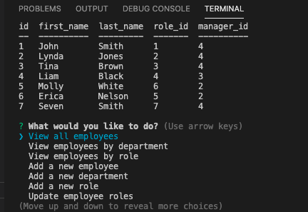

# Employee-Tracker

 
This applications allows companies to view and interact with their employee's information. The command-line application allows the user to add and view departments, roles and employees. It also lets the user update employee roles. Technology used includes node, inquirer and MySQL.

<Strong>Video Link:</Strong>
 
<Strong>Repo Link:</Strong>: https://github.com/amay1421/Employee-Tracker
